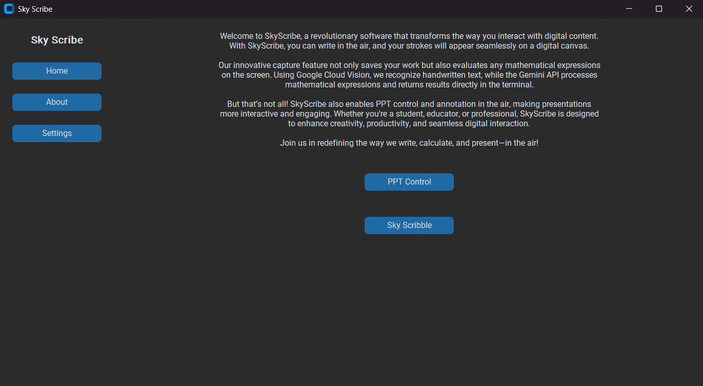
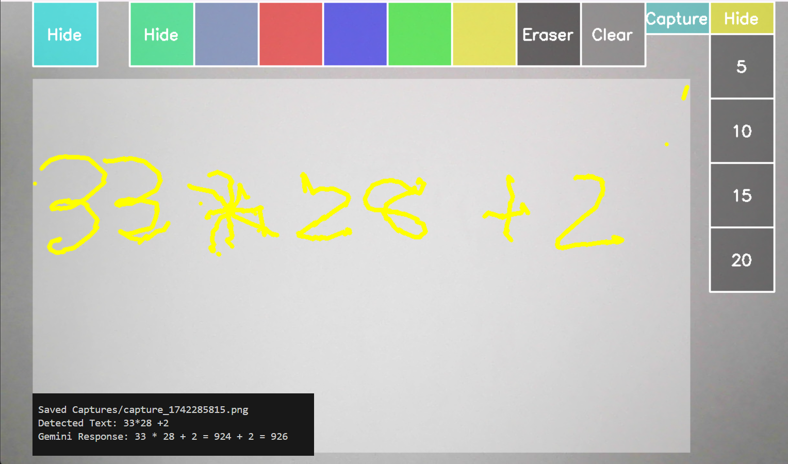
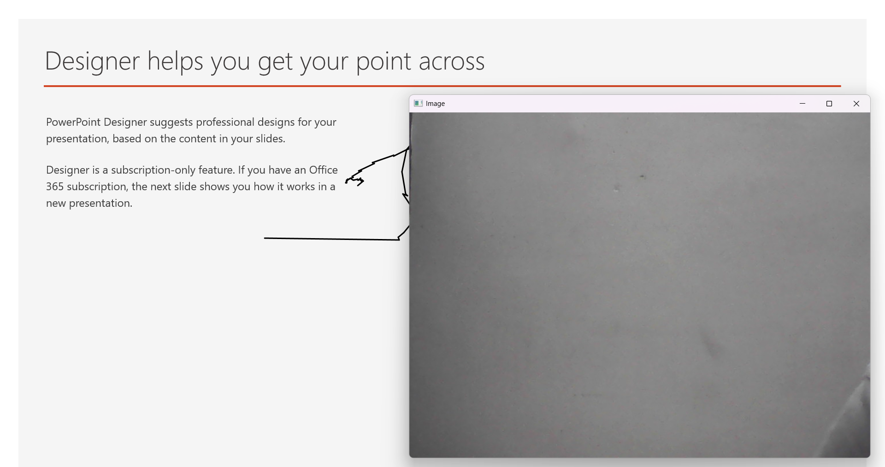

# 🚀 SkyScribe

SkyScribe is an innovative software that enables users to ✍️ write in the air, capturing handwritten input and displaying it on a digital canvas. It also features real-time mathematical expression evaluation using the 🤖 Gemini API and integrates 🧠 Google Cloud Vision for text recognition. Additionally, SkyScribe supports 🎤 PPT control and annotation in the air.

## ✨ Features
- ✍️ **Air Writing**: Capture and display handwritten input in the air.
- 🫤 **Mathematical Expression Evaluation**: Instantly evaluates mathematical expressions using the Gemini API.
- 🔍 **Google Cloud Vision Integration**: Recognizes handwritten text and converts it to digital format.
- 🌊 **PPT Control and Annotation**: Control PowerPoint presentations and annotate slides using air gestures.

## 🛠 Prerequisites
To run SkyScribe, ensure you have the following installed:
- 🐠 Python 3.x
- 📷 OpenCV
- ☁️ Google Cloud Vision API
- 🤖 Gemini API
- 📝 Any additional dependencies listed in `requirements.txt`

## 👅 Installation
1. Clone the repository:
   ```sh
   git clone https://github.com/kolheom1311/Sky-Scribe.git
   cd Sky-Scribe
   ```
2. Create a virtual environment:
   ```sh
   python -m venv venv

   # Linux/macOS 
   source venv/bin/activate

   # On Windows
   venv/Scripts/activate
   ```
3. Install dependencies:
   ```sh
   pip install -r requirements.txt
   ```
4. Set up API keys:
   - 🔑 Configure Google Cloud Vision API and store credentials.
   - 📂 Download the Google Cloud Vision credentials (usually provided as a JSON file) and rename the file to `SkyScribe.json` to comply with the project requirements.
   - 📄 Create a `.env` file (refer to `.env.example`) and add your Gemini API key.

## ▶️ Usage
1. Run the application:
   ```sh
   python main.py
   ```
2. ✍️ Use air gestures to write on the screen.
3. 💲 Press the capture button to evaluate mathematical expressions.
4. 🌊 Control and annotate PowerPoint slides with gestures.

## 📸 Screenshots  
Here are some screenshots showcasing SkyScribe in action:  
1. **SkyScribe Interface** 

   

2. **Canvas**  

     

3. **PPT Control**  

    

## 🎓 Contributors
This project is our **final year B.E. project** developed by:

| Name             | Role                       | LinkedIn |
|-----------------|--------------------------|----------|
| 👨‍💻 **Om Kolhe**    | Developer & Project Lead  | <p align="center"><a screenshots href="https://www.linkedin.com/in/kolheom1311/"></a></p> |
| 👨‍💻 **Sahil Gawande** | Developer & Project Co-Lead | <p align="center"><a screenshots href="https://www.linkedin.com/in/sahil-gawande-085793237/"></a></p> |
| 👩‍💻 **Avanti Kamod**  | Acknowledged Contributor | <p align="center"><a screenshots href="https://www.linkedin.com/in/avanti-kamod-7529942a7/"></a></p> |
| 👨‍💻 **Karunesh Bazaz** | Acknowledged Contributor | <p align="center"><a screenshots href="https://www.linkedin.com/in/karunesh-bazaz1211/"></a></p> |

## 🎤 A Big Shoutout!
We extend our heartfelt gratitude to:

| Name                 | Role                  | LinkedIn |
|---------------------|----------------------|----------|
| 👩‍🏫 **Dr. Smita Dange**  | Project Coordinator | <p align="center"><a screenshots href="https://www.linkedin.com/in/dr-smita-dange-29631a30/"></a></p> |
| 👩‍🏫 **Mrs. Prachi Verma** | Project Guide       | <p align="center"><a screenshots href="https://www.linkedin.com/in/prachiverma/"></a></p> |

## 🤝 Contributing
Contributions are welcome! Feel free to fork the repository and submit a pull request.

## 📝 License
This project is licensed under the MIT License - see the [LICENSE](LICENSE) file for details.

## 📧 Contact
For any queries or collaboration, reach out at [kolheom1311@gmail.com].